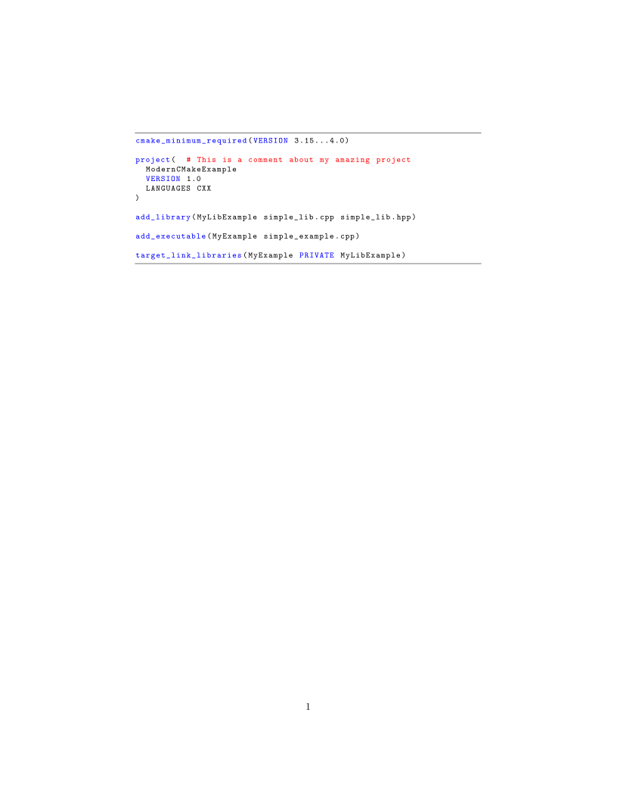

# CMake support for Listings

This is an extension to the [LaTeX package `Listings`](https://ctan.org/pkg/listings), that implements support for the CMake language.

To use it, simply `\usepackage{cmake-listings}` in your LaTeX file, along with your usual `listings` environment, making sure that [`cmake-listings.sty`](./cmake-listings.sty) is reachable either in your LaTeX path or in your working directory.


## Bare minimum working example
```latex
\documentclass{article}
\usepackage{listings}
\usepackage{cmake-listings}

\begin{document}

\begin{lstlisting}[language=CMake]
cmake_minimum_required(VERSION 3.15...4.0)

project(  # This is a comment about my amazing project
  ModernCMakeExample
  VERSION 1.0
  LANGUAGES CXX
)

add_library(MyLibExample simple_lib.cpp simple_lib.hpp)

add_executable(MyExample simple_example.cpp)

target_link_libraries(MyExample PRIVATE MyLibExample)
\end{lstlisting}


\end{document}
```


## Expected result
With a bit of fine tuning of `listings` to make it prettier; see [`tests/test-cmake-listings.tex`](./tests/test-cmake-listings.tex).


## __________

© 2025, Firmin Launay <[hey@firminlaunay.me](mailto:hey@firminlaunay.me)>.  
Released under the LaTeX Project Public License 1.3c or later.
